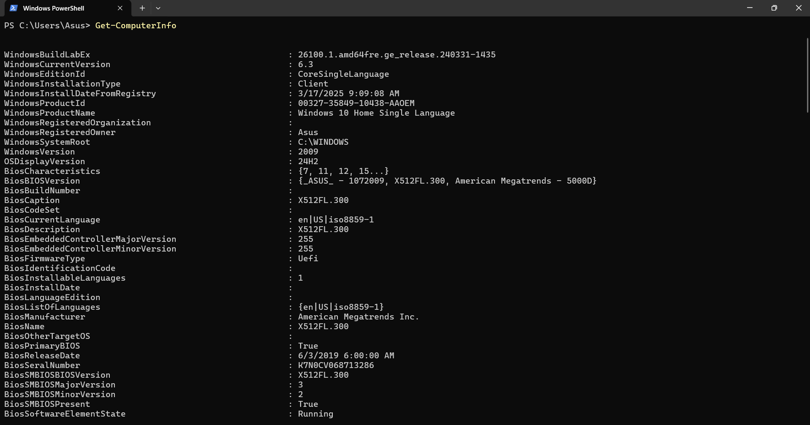
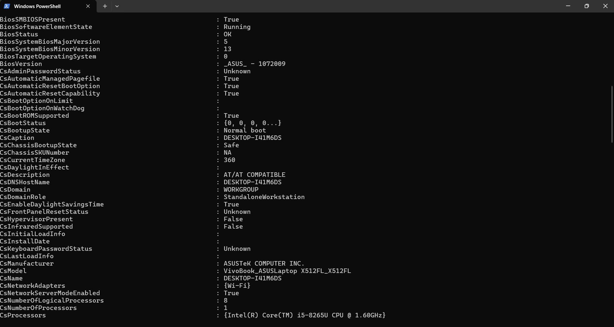
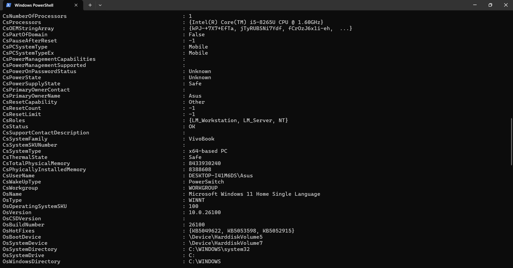
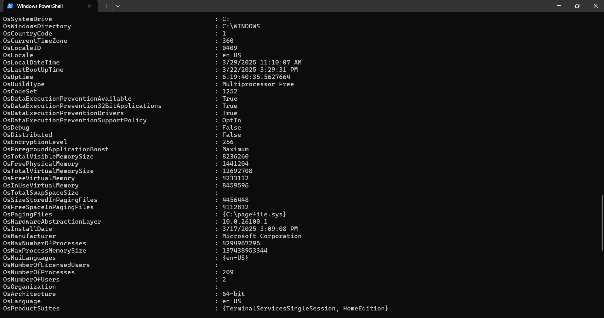
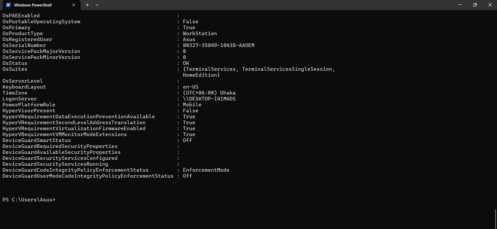
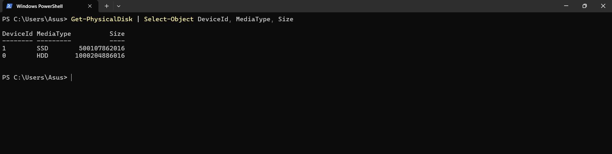
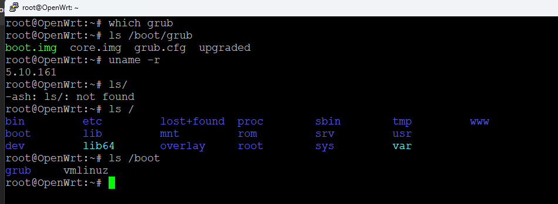
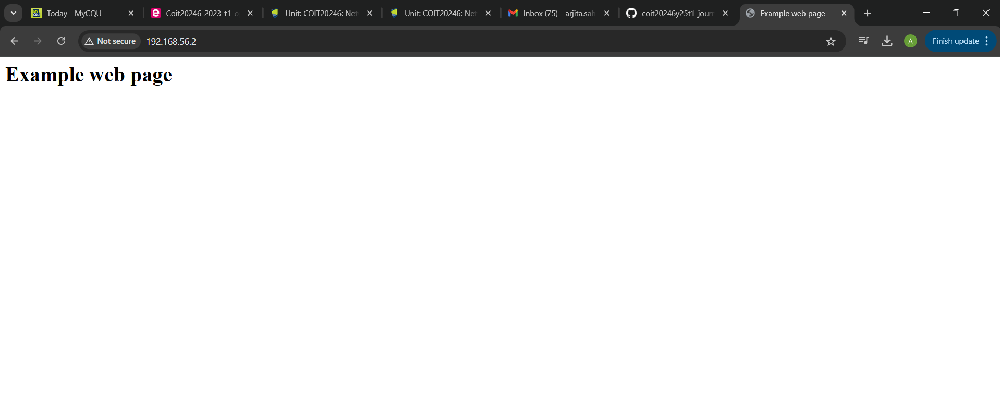
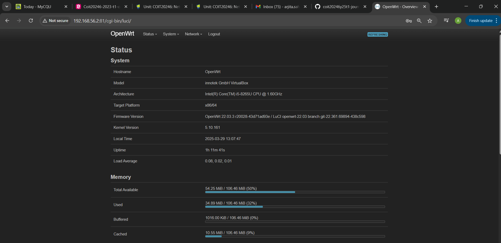
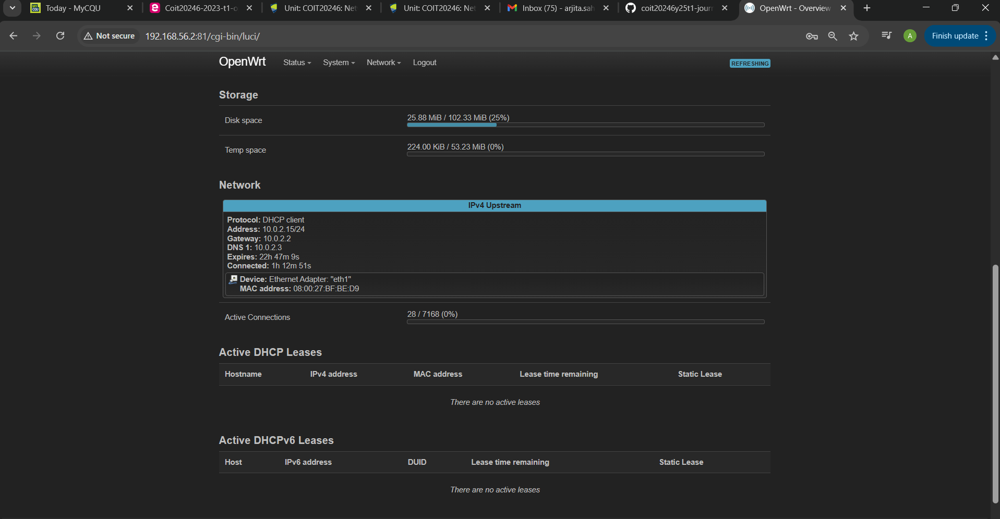

# Week 2 | Computer Systems and Applications2.1

## Task 1. View Computer Information

Processor =  Intel(R) Core(TM) i5-8265U CPU @ 1.60GHz

RAM = 8433930240 Bytes or 7.85470962524414 GB ( 1 GB = 1073741824 bytes)

OSversion =  10.0.26100

Total Disk size =  (1000204886016 + 500107862016)bytes = 1500312748032 Bytes or 1.36452649533749 TB 

## Task 3. Deploy Linux Web Server
A boot manager is a program that chooses which operating system to load from the available storage media during a computer's starting. The Boot Manager enables the user to select the preferred operating system on computers. Having several OS installs, such as dual-boot or multi-boot configurations, boot manager is essential. In the root in OpenWRT command ls / will show the all system directories. Now using ls /boot command will provide the boot manager which is grub, widely used in linux systems.

Kernel, a core component, is controlling hardware connectivity and system resources. It manages input-output activities, memory management, and process scheduling, hardware-software interactions and resource allocation to guarantee seamless system functioning. uname -r is the command to identify kernel in WRT, which is 5.10.161

Virtualbox: With the help of the free program VirtualBox, you may build and operate virtual machines on your own PC. This lets you try out different operating systems, like Linux on a Windows machine, without affecting your main system.

OpenWRT: The open-source operating system OpenWRT is made for routers and gives users more freedom and control than the usual firmware. It's popular with advanced users and network enthusiasts because you can change and improve your router's speed, security, and features.

Created by Chatgpt : 
VirtualBox: VirtualBox is an open-source software used for creating and managing virtual machines (VMs). It allows you to run multiple operating systems on a single physical machine, without affecting the host OS. VirtualBox is widely used for testing software, running different OS environments, or setting up isolated development environments. It supports various guest operating systems like Windows, Linux, macOS, and others, and is popular among developers and IT professionals.

OpenWRT:OpenWRT is an open-source operating system designed for embedded devices, primarily used in routers. Unlike the default firmware provided by router manufacturers, OpenWRT offers more advanced features, better security, and greater customization. It allows users to install additional packages, configure network settings in detail, and have full control over their router's functionality, making it popular among enthusiasts and network administrators looking to optimize their networking devices.

Comparison:
1.The simplified version is easy to understand and more specific for the beginners, where the AI generated version is more informative and detailed, which is overly complex for them but helpful for those who are familiar with.

2.The AI written includes so many technical terms which are not known for the newcomer on the other hand simplified one gives the basic term which can be understood by anyone.

## Task 4. Browse to OpenWRT Websites

Memory (RAM)

Total RAM: The total amount of physical memory available on the system.
Used RAM: The amount of memory currently being used by processes.
Free RAM: The amount of memory that is not currently being used.
Buffer/Cache: The memory used for caching data, which can be released when needed.

Storage (Disk Space)

Total Storage: The total amount of storage available on the device.
Used Storage: The amount of storage currently in use.
Free Storage: The amount of storage available for use.
Mounted File Systems: The directories where storage is mounted.

Network

Protocol: Defines communication rules like IPv4, IPv6, and TCP for data transmission.
Address: The IP address assigned to a device for network communication.
Gateway: Routes data between different networks, like your home network and the internet.
DNS1: The primary DNS server used to resolve domain names into IP addresses.
Expiration: Refers to the DHCP lease time for an IP address, after which it needs renewal.
Connecting: The process of establishing a network connection to communicate with other devices.
